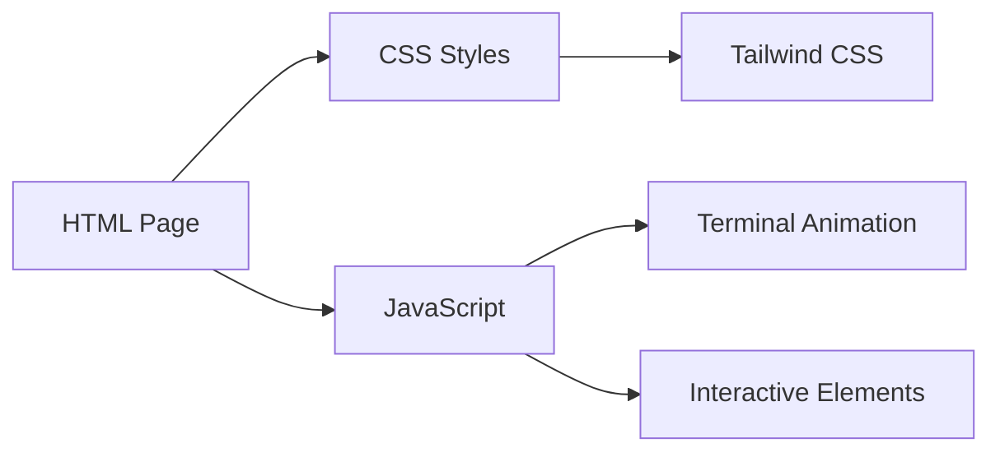

## 1. Architecture Design


## 2. Technology Description
- Frontend: Pure HTML + CSS + JavaScript
- Styling: Tailwind CSS 3 via CDN
- Font: JetBrains Mono from Google Fonts
- Icons: Lucide Icons via CDN

## 3. Route Definitions
| Route | Purpose |
|-------|---------|
| / | Single-page application with all sections |

## 4. File Structure
```
/
├── index.html          # Main HTML file
├── styles.css          # Custom styles
└── script.js           # Interactive JavaScript
```

## 5. Components
1. **TerminalHeader**: Terminal window header with close/minimize buttons
2. **TerminalBody**: Terminal content area with typewriter effect
3. **FeatureCard**: Individual feature showcase card
4. **TechBadge**: Technology stack badge component
5. **AnimatedCursor**: Blinking terminal cursor